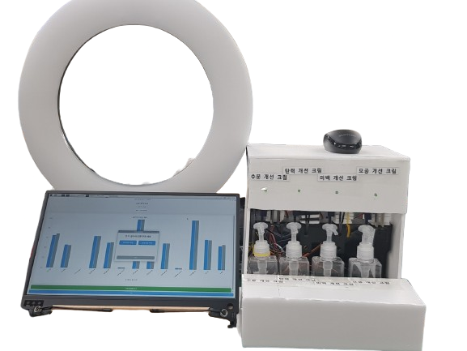
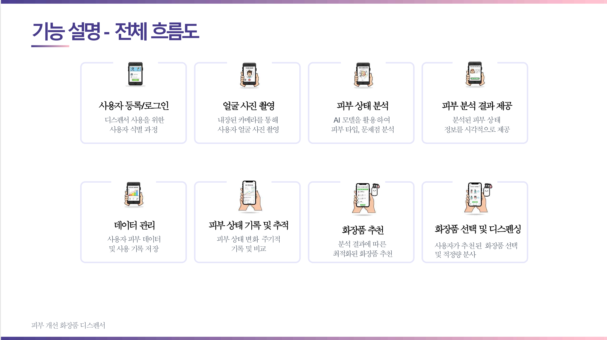

# 피부 개선 디스펜서 (Skin Improvement Dispenser)

Intel 07 Final Project - Team 3




발표 ppt : 
## 📋 프로젝트 개요

AI 카메라 기술을 활용하여 사용자의 피부 상태(수분, 탄력, 색소침착, 모공)를 실시간으로 분석하고, 개인 맞춤형 화장품을  자동 디스펜싱하는 스마트 뷰티 디바이스입니다.

### 주요 기능
- 🎥 **AI 기반 피부 분석**: Intel Geti SDK + PyTorch를 활용한 5개 얼굴 영역별 피부 상태 분석
- 💧 **다중 피부 지표 측정**: 수분, 탄력, 색소침착, 모공 상태 정량화
- 🧴 **스마트 디스펜싱**: 분석 결과 기반 개인 맞춤형 화장품 자동 분배
- 📊 **사용자 프로필 관리**: SQLite 기반 분석 이력 및 개인 데이터 저장
- 🔄 **실시간 처리**: Qt GUI를 통한 실시간 카메라 캡처 및 분석 결과 확인

## 🏗️ 시스템 아키텍처

### 시스템 아키텍처



```
Qt GUI Client → Image Processing Server → Hardware Control Server → Dispensing Hardware
     ↓                    ↓                        ↓                      ↓
  [카메라 캡처]         [AI 피부 분석]           [UART 통신]           [모터 제어]
  [사용자 UI]          [Intel Geti SDK]         [하드웨어 제어]        [제품 분배]
```

### 데이터 흐름
```
Qt Client → [HTTP POST /upload] → [AI Processing] → [HTTP POST /receive] → [UART] → Hardware(화장품 디스펜서, STM32, 서보)
```

### 주요 컴포넌트

#### 1. Qt GUI Client (`Qt/camera_Qt/`)
- **기술**: C++17 + Qt5
- **기능**: 카메라 인터페이스, 사용자 UI, SQLite 데이터베이스 관리
- **통신**: HTTP 클라이언트로 Flask 서버와 연동

#### 2. Hardware Control Server (`Server/rasp.py`)
- **기술**: Python Flask + UART 시리얼 통신
- **기능**: 분석 데이터 수신, 하드웨어 제어, UART 프로토콜 변환

#### 4. AI Models (`AI/`)
- **기술**: PyTorch + Python Flask + Intel Geti SDK + ResNet-50
- **기능**: ROI 검출, 피부 특성 분석, 분석 데이터 발신.
- **모델**: ROI 검출 + 다중 헤드 피부 특성 분석
- **영역**: 이마, 좌/우 볼, 턱, 입술 (총 5개 영역)

## 🚀 설치 및 환경 설정

### 시스템 요구사항
- **OS**: Linux (Ubuntu 권장)
- **Python**: 3.10.12<=
- **Qt**: Qt5
- **GPU**: CUDA 11.8 지원 (AI 학습용)
- **Hardware**: 카메라, Raspberry Pi, UART 지원 장치

### 1. Python 환경 설정
```bash
# 가상환경 활성화
cd Server
source venv/bin/activate

# 의존성 설치
pip install -r requirements.txt
```

### 2. AI 모델 환경 설정
```bash
cd AI
pip install -r requirements.txt

# Intel Geti SDK 설치 확인
pip install geti-sdk==2.6.0
```

### 3. Qt 개발 환경

라즈베라파이에서 빌드하는 것을 기준으로 

```bash
# Qt 프로젝트 빌드
cd Qt/camera_Qt
qmake camera_Qt.pro
make
```

## 🔧 사용법

### 라즈베리파이 UART 설정

```bash
cd /boot/firmware
vi config.txt
dtoverlay=uart3 # /dev/ttyAMA3 살리기, config.txt 가장 하단에 추가

ls /dev/tty*
# /dev/ttyAMA3 가 나오게 uart가 설정됨.
```
### 하드웨어 통신 서버 시작

라즈베리파이에서 

```bash
cd Server
source venv/bin/activate
python3 rasp.py
```

### Qt 애플리케이션 실행
```bash
cd Qt/camera_Qt
./camera_Qt
```

### AI 모델 학습 및 추론
```bash
cd AI

# 학습
c_coco.py #데이터셋의 json 파일을 학습에 맞게 변환
train_skin_roi_v4.py #roi 별로 학습

# 추론
ifer_skin_server_geti.py # 학습된 pth파일+geti deployment 파일이 메모리에 적재됨.
# 추론과 라즈베리파이와 통신이 이루어진다.
```

## 📡 API 문서

### Image Processing Server (node.py:5000)
- **POST** `/upload` - 이미지 파일 업로드 및 AI 분석 요청

### Hardware Control Server (rasp.py:4387)
- **POST** `/receive` - 분석 결과 데이터 수신
- **GET** `/get_analysis` - 최신 분석 결과 조회
- **GET** `/test_data` - 테스트 데이터 생성
- **GET** `/clear_data` - 저장된 데이터 초기화

### UART 통신 프로토콜
- **데이터 포맷**: 14개 수치값을 "@" 구분자로 연결
- **순서**: `이마(수분,탄력,색소침착) + 좌볼(수분,탄력,색소침착,모공) + 우볼(수분,탄력,색소침착,모공) + 턱(수분,탄력) + 입술(건조도)`
- **통신 설정**: `/dev/ttyAMA3`, 115200 baud rate

## 🔬 AI 모델 상세

### Intel Geti SDK 통합
- **Face Detection**: Geti SDK 배포 모델 활용
- **배포 디렉토리**: `AI/geti_face_v2/deployment/`, `AI/getitest/deployment/`
- **추론 스크립트**: `infer_skin_server_geti.py`

### 피부 분석 파이프라인
1. **ROI 검출**: Intel Geti SDK로 얼굴 영역 식별
2. **영역 분할**: 5개 얼굴 영역별 ROI 추출
3. **특성 분석**: ResNet-50 기반 다중 헤드 모델로 피부 지표 예측
4. **결과 통합**: 영역별 분석 결과를 통합하여 최종 수치 산출

### 학습 모델 버전
- **v2**: 기본 ResNet 아키텍처
- **v3**: 개선된 특성 추출
- **v4**: 최신 버전 (현재 사용)

## 🛠️ 하드웨어 구성

### Raspberry Pi 설정
```bash
# UART 장치 확인
ls -la /dev/ttyAMA3

# 권한 설정
sudo chmod 666 /dev/ttyAMA3
```

### 모터 제어 시스템
- **Task**: 서보 모터 - 90° 왕복 운동
- **제어**: STM32 RTOS 기반 concurrent 모터 제어

## 📂 프로젝트 구조

```
Intel07_Intelproject_Team3/
├── AI/                     # AI 모델 및 추론 코드
│   ├── geti_face_v2/       # Intel Geti 배포 모델
│   ├── train_skin_roi_v4.py         # 모델 학습 스크립트
│   ├── c_coco.py         # 모델 학습 데이터 셋 전처리 스크립트
│   └── infer_skin_server_geti.py         # 추론 스크립트
├── Server/                 # Flask 서버
│   └── rasp.py             # 하드웨어 통신 서버
├── Qt/camera_Qt/           # Qt GUI 애플리케이션
│   ├── mainwindow.cpp      # 메인 윈도우
│   ├── databasemanager.cpp # 데이터베이스 관리
│   ├── analysisresultdialog.cpp  # 결과 다이어그램 창 
│   ├── nameinputdialog.cpp # 이름 입력창
│   └── *.ui                # UI 파일들
├── HW/                     # 하드웨어 제어 코드
│   ├── raspi/              # Raspberry Pi 스크립트
│   ├── servostepmotor/     # 모터 제어
│   └── stm32_src/          # STM32 펌웨어
└── README.md               # 개발 가이드
```

## 🤝 개발 및 기여

### 개발 워크플로우
1. 기능 브랜치 생성
2. 로컬 테스트 수행
3. Pull Request 생성
4. 코드 리뷰 및 병합

### 코딩 스타일
- C++: C++17 표준 준수
- Python: PEP 8 스타일 가이드
- Qt: Qt 네이밍 컨벤션

## 👨‍💻 팀원
- 신승엽
- 김진형 
- 오민지
- 윤치영
- 황경태

## 📚 출처

본 프로젝트는 [AI-Hub 한국인 피부상태 측정 데이터](https://www.aihub.or.kr/aihubdata/data/view.do?pageIndex=1&currMenu=115&topMenu=100&srchOptnCnd=OPTNCND001&searchKeyword=%ED%95%9C%EA%B5%AD%EC%9D%B8&srchDetailCnd=DETAILCND001&srchOrder=ORDER001&srchPagePer=20&srchDataRealmCode=REALM001&aihubDataSe=data&dataSetSn=71645)를 활용하였습니다.


## 📄 라이선스

본 프로젝트는 연구 및 학습 목적의 졸업작품으로 개발되었습니다.  

- PyTorch: [MIT License](https://opensource.org/licenses/MIT)  
- Qt: [LGPL v3 License](https://www.gnu.org/licenses/lgpl-3.0.html)  

본 프로젝트 코드는 별도의 오픈소스 라이선스를 지정하지 않았으며, 연구 목적 내에서 자유롭게 활용할 수 있습니다.  
Qt 라이브러리는 LGPL 조건에 따라 사용되었으며, 사용자는 Qt 라이브러리를 교체하거나 수정된 Qt 소스를 확인할 수 있습니다.


